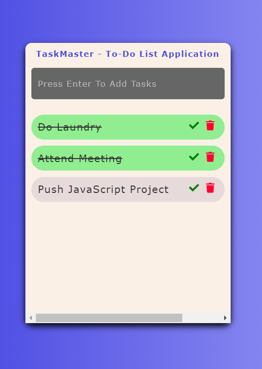

# Task Master
Task Master is a simple to-do list application that allows you to add, mark, and delete tasks.

## Preview

## Features
- Add tasks by entering them in the input field and pressing enter.
- Mark tasks as done by clicking the checkmark icon.
- Delete tasks by clicking the trash bin icon.
- Responsive design for optimal use on different devices.

## Getting Started

### Prerequisites
- Web browser (Google Chrome, Mozilla Firefox, etc.)

### Installation
1. Clone the repository:
1. Open the index.html file in your web browser.

## Usage
- Enter a task in the input field and press enter to add it to the list.
- Click the checkmark icon to mark a task as done.
- Click the trash bin icon to delete a task.

## Contributing
Contributions are welcome! If you find any issues or have suggestions for improvements, please feel free to open an issue or submit a pull request.

## Acknowledgements
- Font Awesome for providing the icons used in the application.
- jQuery for simplifying DOM manipulation and event handling.

## Credits
This project was created by Kalutu Daniel.
